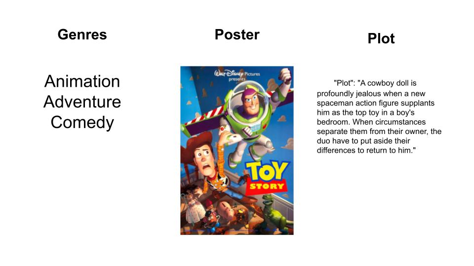
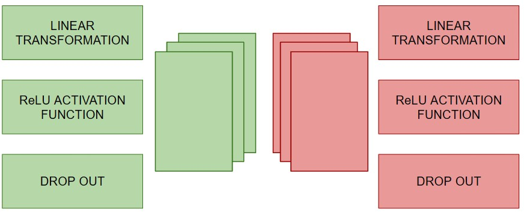
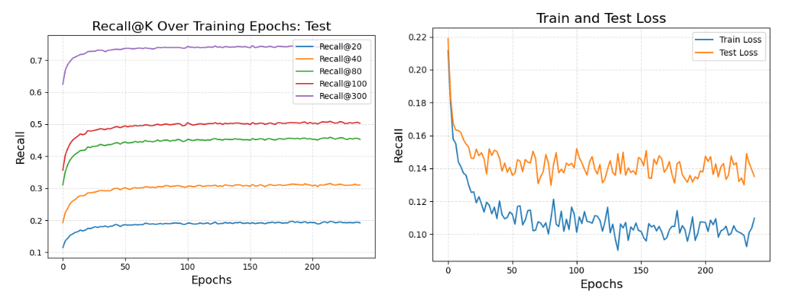

<!-- PROJECT LOGO -->
 

  

  <h3 align="center">Movie Recommendation Website</h3>

  

    A fully designed Movie Recommendation System from Scratch
    <!--  
    <a href="https://github.com/othneildrew/Best-README-Template"><strong>Explore the docs »</strong></a>
     \
     
    <a href="https://github.com/othneildrew/Best-README-Template">View Demo</a>
    &middot;
    <a href="https://github.com/othneildrew/Best-README-Template/issues/new?labels=bug&template=bug-report---.md">Report Bug</a>
    &middot;
    <a href="https://github.com/othneildrew/Best-README-Template/issues/new?labels=enhancement&template=feature-request---.md">Request Feature</a>
  
 -->

<!-- TABLE OF CONTENTS -->

  
Table of Contents

  <ol>
    <li>
      <a href="#about-the-project">About The Project</a>
      <ul>
        <li><a href="#built-with">Built With</a></li>
      </ul>
    </li>
    <li>
      <a href="#getting-started">Getting Started</a>
      <ul>
        <li><a href="#prerequisites">Prerequisites</a></li>
        <li><a href="#installation">Installation</a></li>
      </ul>
    </li>
  </ol>

<!-- ABOUT THE PROJECT -->
## About The Project

[![Product Name Screen Shot][product-screenshot]](https://example.com)

We developed machine learning model for movie recommendation using the MovieLens-1M dataset. The model uses data of users and movies they have watched. Additional features were encoded such as movie metadata and posters to enrich the model and improve recommendation. 

After training, the machine learning model was deployed to a web application built with React for the frontend, FastAPI for the backend. Movie metadata and user data was stored and managed in a PostgreSQL database. For the full pipeline see [Model Pipline](#Model-Pipeline)

(<a href="#readme-top">back to top</a>)

### Built With
* 
* 
* 

* 
* 
* 
* 
* 

* 
* 

(<a href="#readme-top">back to top</a>)

## Machine Learning Pipeline
#### Data Collection 
We utilize the MovieLens 1M dataset which contains 1 million ratings from 6000 users across 3900 movies. Our model uses this data to learn differnt user preferences. The goal is to learn user preferences. For example, the model may learn that a user who is interested in horror movies also like action movies.  

We first engineer features for users and movies:

##### Movie Features

We create features for the movie by utilizing genres, the movies poster as well as its plot. To capture genres, we apply one-hot encoding across 17 genre categories. We use open source models from [Hugging Face](https://huggingface.co/), [CLIP ViT-B/32](https://huggingface.co/sentence-transformers/clip-ViT-B-32) and [all-MiniLM-L6-v2](https://huggingface.co/sentence-transformers/all-MiniLM-L6-v2), to transform the poster and text summary into numerical embeddings. We then concat the genre vector and the 2 numerical embeddings for the machine learning model.

##### User Features
For each user we utilize their age, gener and occupation. We also incorporate the user's watch history in their feature vector.

[gender, age, occupation, m₁, m₂, m₃, …, mₙ]

Where mₙ = 1 if the user has watched that movie and mₙ = 0 if the user has not watched that movie. 

#### Training Pipeline 
Our training pipeline consists of three main stages. 

1. **Initial Transformation**  
   We apply a linear transformation to the user and movie embeddings, projecting them into the same dimensional space.

$$
\mathbf{U}^{(1)} = \sigma \Big( \mathbf{W}_u^{(0)} \mathbf{U}^{(0)} + \mathbf{b}_u^{(0)} \Big)
\quad \quad 
\mathbf{M}^{(1)} = \sigma \Big( \mathbf{W}_m^{(0)} \mathbf{M}^{(0)} + \mathbf{b}_m^{(0)} \Big)
$$

$$
\text{Where}
- \(\mathbf{U}\) are the features of the users
- \(\mathbf{M}\) are the features of the movies
- \(\mathbf{W}  \ \text{and} \ \mathbf{b}\) are learnable parameters
$$

3. **Feature Enhancing**  
   We enrich user features by encoding the movies they have watched into their feature vector. To do this, we add the embeddings of all the movies the user has watched into their own feature vector. 
$$
\mathbf{U}_u^{(2)} = \mathbf{U}_u^{\text{(1)}} + \sum_{i \in \mathcal{M}_u} \mathbf{M}_i^{(1)}
$$
$$
Where 

- \(\mathbf{U}_u^{\text{(1)}}\) is the user's transformed feature vector (e.g., age, gender, occupation)  
- \(\mathcal{M}_u\) is the set of movies watched by user \(u\)  
- \(\mathbf{M}_i^{(1)}\) is the embedding vector of movie \(i\)
$$

4. **Deep Layer Transformations**  

    
    
    We then pass movie and user embeddings through respective neural network towers. Each layer linearly transforms the embedding, applies a ReLU activation function for non-linearity and then a drop-out to prevent over fitting. 

5. **Final Feature Stacking**
    To generate the final features for users and movies, we take the average sum of all the features obtained each layer. 

#### Optimization and Loss Function 

To rate the probability of user U liking a movie M, we use a score function to generate the probability that the user U will watch the movie M. In our model we use the dot product. To optimize our model, we use Bayesian Personalized Ranking Loss to maximize the probablity of interacted with items over non-interacted with items. 

$$
\mathcal{L}_{\text{BPR}} = - \sum_{(u,i,j) \in \mathcal{D}} \ln \sigma \left( \hat{y}_{ui} - \hat{y}_{uj} \right)  + \lambda \|\Theta\|_2^2
$$

#### Model Parameters 

- **Embedding Size:** 512
- **Layers:** 2
- **Epochs:** 240
- **Weight Decay:** 1e-5
- **Learning Rate:** 0.001
- **Dropout:** 0.2

#### Evaluation 

